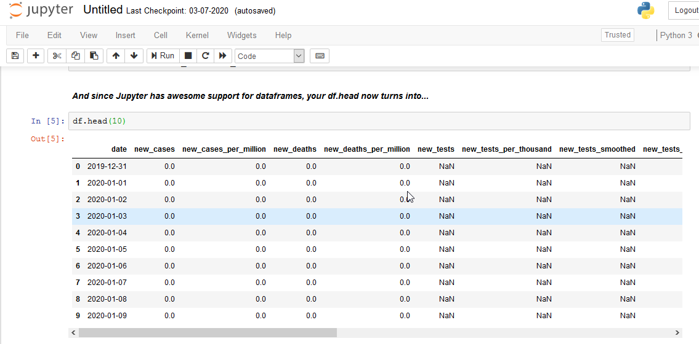
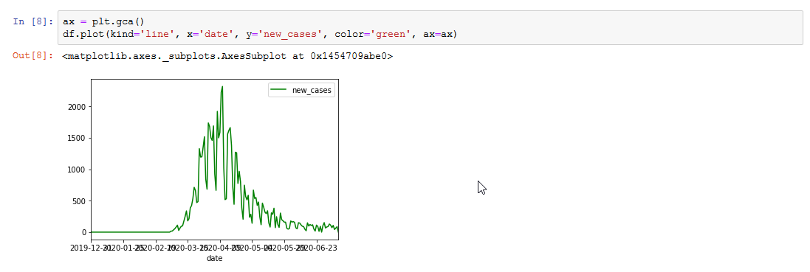
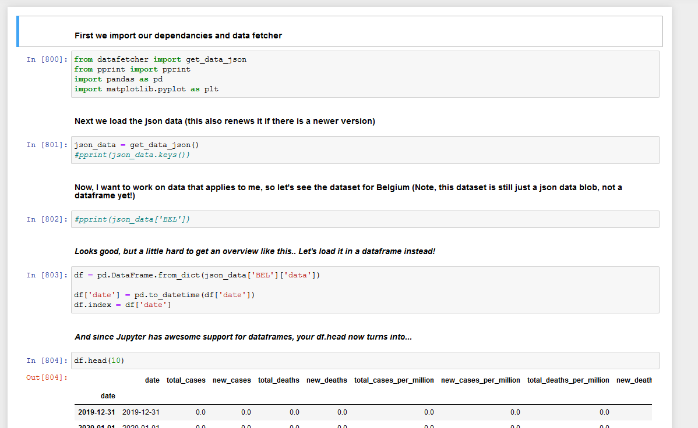
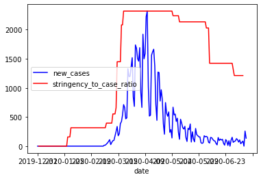
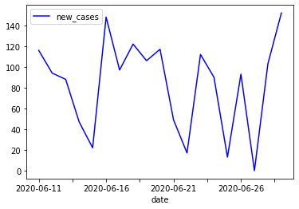
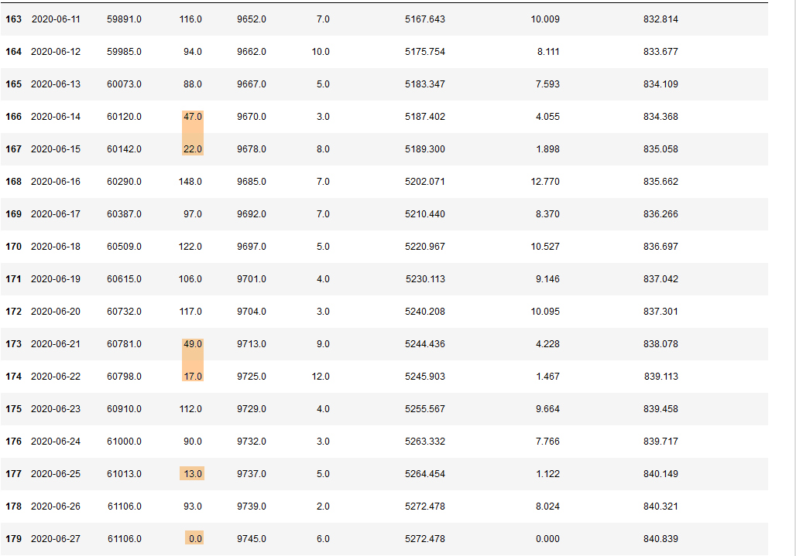
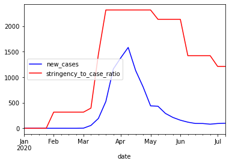
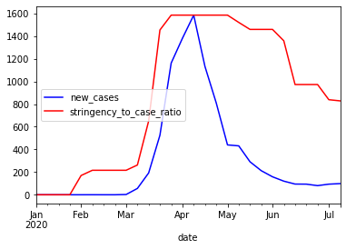
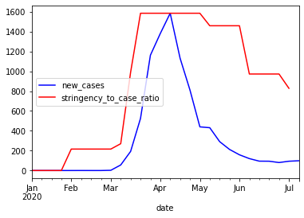

Title: Analyzing covid-19 data with pandas and matplotlib
Date: 2020-07-12
Category: Learning
Tags: guest, pandas, matplotlib, data analysis
Slug: guest-covid-19-data-analysis-pandas
Authors: Cedric Sambre
summary: One moment I was solving a pandas challenge, next I was analyzing real world covid-19 data with python...

Some time ago, I was talking to [Martin](https://twitter.com/clamytoe) on the Pybites Slack about a challenge that involved the `pandas` library.

I never really looked at data analysis, but triggered to complete the challenge ahead, I dove into the library and immediately noticed how strong it was to manage large data collections.

Throughout this article we'll have a basic look at collecting data to handle with pandas, normalizing it so that it becomes more representative, and I'll have a small stop at Jupyter notebooks. 

# Index

* [Requirements](#requirements)
* [Disclaimer](#disclaimer)
* [Part 1: Getting Data](#getting-data)
* [Part 2: The forest and the trees](#forest-trees) 
* [Part 3: This isn't normal, is it?](#normal-not-normal)
* [Conclusion](#conclusion)

##### Disclaimer

This document is just a resource to demonstrate a python programming library on data that is actual.

I'm not a data analyst nor a virologist, I'm just someone who likes to explore data and who loves to create tools doing so.
There are some calculations that I have made in this document that can be made more statistically accurate, I'm *just playing around*.


For correct and up to date information regarding Covid-19, please visit your local governments website.

<a name="getting-data"></a>
### Part 1: Getting Data

If you open a newspaper nowadays, you get shown a lot of numbers regarding the evolution of the Covid-19 virus.
All data regarding new infections, new deaths, testing and a lot of other things, are all stored by the WHO, the ECDC and the John Hopkins Institute.

Lucky for us, [OWID (Our World In Data)](https://ourworldindata.org/) already created collections of the WHO and ECDC data.
These collections are stored on [their github](https://github.com/owid/covid-19-data/tree/master/public/data).

If you open the repo, you'll notice there's a `last-updated-timestamp.txt` file that looks like this:


That's actually great! Why?

This timestamp represents the last update of the data collection.
If we download the data and the timestamp once, we can simply check this 19 byte file if it has changed rather than having to compare the 15.6 MB Json blob manually every time we want to validate our data.

What's also nice is that this is a representation in ISO format, which can be handily loaded in a `datetime` in python:

```
     if os.path.exists(TIMESTAMP_TMP):
        with open(TIMESTAMP_TMP, "r") as _tsf:
            current_timestamp = _tsf.read()
        current_datetime = datetime.fromisoformat(current_timestamp)  
```

Next, all we have to do is compare the date in the local file against the date in the remote file:
```
    with requests.Session() as _sess:
        new_timestamp = _sess.get(TIMETAMP_URL).text
    new_datetime = datetime.fromisoformat(new_timestamp)
```

And if these differ, we can download the data to our data folder! 

Have a look at `datafetcher.py` on [my github](https://github.com/jarviscodes/covid-19-view/blob/master/code/datafetcher.py) to see how I pulled all this together.

<a name="forest-trees"></a>
### Part 2: The forest and the trees.

In Dutch there's a saying: 
> "You can't see the forest through the trees anymore".

Which means that a lot of data dancing in front of your eyes can cause you to completely miss the bigger picture the data is portraying.

#### Pandas
Great, we have the data!

JSON is pretty clearly structured and in many cases, it's more than sufficient to use in your python code.
However, if you open the json file, you can see that there are hundreds of entries that are nested into the hundred country codes.

When working with data that's this size, things get complicated fast.

In comes `pandas`!

Pandas is described as follows on the package website:

> pandas is a Python package providing fast, flexible, and expressive data structures designed to make working with “relational” or “labeled” data both easy and intuitive. It aims to be the fundamental high-level building block for doing practical, real world data analysis in Python.

In short, pandas provides ways to make working with large data programmatically accessible.

One example would be a `DataFrame`, which you can see as some sort of table object with a lot of information about the content.
It can have indexes and column names to address or group data properly, which is exactly what we are going to be using.

Here's an example pprinted dataframe, so you can get an idea what they look like.

```
                 date  new_cases  stringency_index
date                                              
2019-12-31 2019-12-31        0.0               NaN
2020-01-01 2020-01-01        0.0              0.00
2020-01-02 2020-01-02        0.0              0.00
2020-01-03 2020-01-03        0.0              0.00
2020-01-04 2020-01-04        0.0              0.00
...               ...        ...               ...
2020-07-08 2020-07-08       65.0             42.59
2020-07-09 2020-07-09       87.0             42.59
2020-07-10 2020-07-10        0.0               NaN
2020-07-11 2020-07-11      259.0               NaN
2020-07-12 2020-07-12      137.0               NaN

[195 rows x 3 columns]

```

You can see that the dataframe knows the shape of our data (195x3), it has a date index and column names.

There's also a bunch of methods that are being exposed to inspect your data.

The `head()` function for example, shows a specified number of records of the dataframe you apply it to:

So let's say that instead of printing the entire dataset, I would print `df_slice.head(5)`, the result would be this:

```python

                 date  new_cases  stringency_index
date                                              
2019-12-31 2019-12-31        0.0               NaN
2020-01-01 2020-01-01        0.0               0.0
2020-01-02 2020-01-02        0.0               0.0
2020-01-03 2020-01-03        0.0               0.0
2020-01-04 2020-01-04        0.0               0.0
```

And this is just a small example of what you can do with pandas!

#### Jupyter
I want to dedicate a small section to Jupyter Notebooks!

For people who commonly work with data, `Jupyter` will likely be a very familiar tool, for others that struggle with `pprint`'ed `df.head()`'s, a new door might open. 
Jupyter notebooks are basically python powered scratchpads.

The notebook I used for this project will also be on [my github](https://github.com/jarviscodes/covid-19-view).
But honestly, take this thing as the scratchpad that it is where I randomly try to correlate stuff ;-)

`Jupyter` has support for `matplotlib` and `pandas` which make it awesome to use for analyzing data:

Here's an example representation of a `df.head()`:



Or just a plot:



Of course you can do this with just regular scripts, but I personally think that these 2 integrations alone make jupyter a must-have for data analysis!

If you would like to run the Notebook from my github, you can simply install jupyter:

`pip3 install jupyter`

Next, you clone the entire github repo:

`git clone https://github.com/jarviscodes/covid-19-view.git`

Now you launch jupyter by running:

`jupyter notebook`

And in jupyter in your browser you can navigate to the `covid-19-view/code/` directory and open `Notebook-covid19.ipynb`.

It should look like this:

 

You can make modifications to the notebook as you please.

<a name="normal-not-normal"></a>
### Part 3: This isn't normal, is it? 

#### Badum.. tss...

While scratching around on my Jupyter notebook, I noticed something called "the stringency index".
A few Google searches later, I learned the [definition](https://ourworldindata.org/grapher/covid-stringency-index).

> The Government Response Stringency Index is a composite measure based on nine response indicators
including school closures, workplace closures, and travel bans, rescaled to a value from 0 to 100 (100 =
strictest response).

It would seem to me, that the stricter your government was, the more the general curve of new cases would go down. 

Let's plot the data !

```python
ax = plt.gca()
df.plot(kind='line', x='date', y='new_cases', color='blue', ax=ax)
df.plot(kind='line', x='date', y='stringency_index', color='red', ax=ax)
```

Aaaand...


The result is completely anticlimactic!

##### The graph, it speaks.

The way the graph looks, it's very hard to tell if the Belgium was stricter in it's policies at some time or not.

This phenomenon can be explained by the fact that the units of the stringency index and the new cases are completely unrelated.

The stringency index is a value between 0 and 100. Where the new cases is any number between 0 and the total uninfected population.

For Belgium, at the time of writing, the maximum stringency index was at 81.48% strictness.
If we take this as the maximum stringency index (although not entirely correct since max would be 100), we can use this value to calculate the relation between the stringency index and the new_cases.
This ratio can then be used to plot the stringency graph so that the relation between the 2 becomes more apparent.

```python
df_stringency_max = df['stringency_index'].max()
df_newcases_max = df['new_cases'].max()

# Calculate the stringency to new_cases ratio
stringency_newcases_ratio = df_newcases_max / df_stringency_max

# Add a column for the related values

df['stringency_to_case_ratio'] = df['stringency_index'] * stringency_newcases_ratio
ax = plt.gca()
df.plot(kind='line', x='date', y='new_cases', color='blue', ax=ax)
df.plot(kind='line', x='date', y='stringency_to_case_ratio', color='red', ax=ax)
```



As you can see between the previous new_cases graph and this one, a new spike in cases is apparent.
But it's hard to tell if the stringency really has an influence on these new cases.

#### But why?

With the recent decrease in anti-covid measurements (schools and stores have reopened etc), we can see that the numbers appear to be rising again.
There are however now clear turning points for some reason.

And theres something else...

#### Why does it bounce?

As mentioned before, I'm just a simple programmer, not a virologist or a genius in statistics.
But as a programmer, I think it's only logic that if you add `infected * spread_rate` with `current_uninfected` you'd get a rather smooth line that turns as the `spread_rate` changes.

The graph for Belgium's new cases isn't smooth at all. 
It's jagged which basically means that one day there's a lot of new cases, and the next day there's very little.

I manually took a small cut of the dataframe to see if the numbers would make any sense.
So I split a set where I noticed heavy bouncing, and drew it out:

```
weird_bounce = df[(df['date'] > '2020-06-10') & (df['date'] < '2020-06-30')]
ax = plt.gca()
weird_bounce.plot(kind='line', x='date', y='new_cases', color='blue', ax=ax)
weird_bounce
```



And in numbers:



Not coincidentally, some of these drops are on saturdays and sundays, with a slight increase after the weekend.
This was caused by the tests not always being conducted in the labs on weekends, but of course, there's days like Thursday the 25th of June where there's a drop from ~90 to 13 new cases for no reason at all.

In order to normalize these results, in this case, it would be appropriate to take the average on a per-week basis.
Allthough part of me feels that we should fill in the averages of the week on the days of the drops.

Just because tests have not been conducted does not mean the virus has stopped spreading.
I think these types of speculations are interesting to look at, but I'll just work with the data we have, for now. :-)

So we take a new slice, group the slice by week and take the mean of the rest of the values. 

```python
df_slice = df[["date", "new_cases", "stringency_index", "stringency_to_case_ratio"]]
df_grouped = df_slice.groupby([pd.Grouper(key='date', freq='W-MON')]).mean()

ax = plt.gca()
df_grouped.plot(kind='line', y='new_cases', color='blue', ax=ax)
df.plot(kind='line', y='stringency_to_case_ratio', color='red', ax=ax)
```

Which produces the following result:



Now there's 2 more 'problems' that have been introduced.

The stringency to case ratio is still calculated on the max of the new cases without the 'normalization' of the bouncing data.

```python
df_slice = df[["date", "new_cases", "stringency_index"]]
df_grouped = df_slice.groupby([pd.Grouper(key='date', freq='W-MON')]).mean()

df_stringency_max = df_grouped['stringency_index'].max()
df_newcases_max = df_grouped['new_cases'].max()

# Calculate the stringency to new_cases ratio
stringency_newcases_ratio = df_newcases_max / df_stringency_max

df_grouped['stringency_to_case_ratio'] = df_grouped['stringency_index'] * stringency_newcases_ratio

ax = plt.gca()
df_grouped.plot(kind='line', y='new_cases', color='blue', ax=ax)
df_grouped.plot(kind='line', y='stringency_to_case_ratio', color='red', ax=ax)
```



The next problem is that the stringency is now also represented by it's average over different weeks, and this is not entirely correct.
The Belgian government has meetings every week, and then makes decisions based on that weeks numbers so the decisions are rather sudden.

We can solve this by changing this line:

`df_grouped['stringency_to_case_ratio'] = df_grouped['stringency_index'] * stringency_newcases_ratio`

Into this:

`df_grouped['stringency_to_case_ratio'] = df['stringency_index'] * stringency_newcases_ratio`

Now we will multiply the original stringency index with the ratio calculated with the max value of the mean of the new cases (phew).



Now the graph represents the decisions taken as sudden as they are by showing less rounded corners.

<a name="conclusion"></a>
### Conlusion 

Although pandas and data analysis in general were quite far from my comfort zone, I managed to get nice results with relatively little code.
It was really a fun puzzle to connect the numbers to reality and figure out why new case reports were dipping for example.

Both `pandas` and `matplotlib` can be very powerful tools to analyse all sorts of data and seeing the bigger picture.

