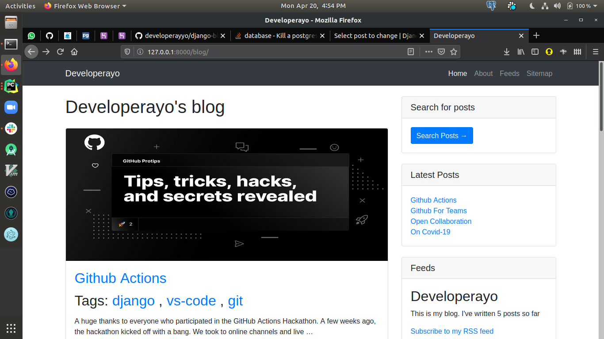

Title: Django Blog
Date: 2020-04-20 16:00
Category: Web Developement
Tags: guest, django, pybites  challenge 
Slug: django-blog
Authors: Peter Babalola
summary: Have you ever wanted to create awesome stuffs with Django like making your own blog or any other app but don't know
 where to start? Or are you tired of taking lazy tutorials?
I found myself in the same situation but all it really takes is to get started with Pybites challenges, Stackoverflow and Github.  
cover: I've been "learning" and "programming" in Python for a while now, but I still find it very difficult to build projects
I've always wanted to build because I think that I don't have enough knowledge and experiences to make them happen.
I've learned enough to be able to help others in my school and workplace from time to time, but new enough that I still
get distracted by the next shiny package I hear about on a podcast or twitter.
So I begin to devour articles and biographies of various tech giants and best programmers on the planet, started following them on twitter and github.
Fortunately I saw Pybites posts on some python challenges on twitter, when I looked at it, I thought these challenges are tough but I 
will give it a try and today I can believe I solved the challenge even beyond the scope of what I was asked to do. So I made a open source django blog
found [here](https://github.com/developerayyo/django-blog). You can modify it to your taste and I believe it will 
be a great way to start you django journey. So the main piont here is: that getting started, persisting to finish, working with what others have done, and
and contributing to open source is what you need to become the best developer out there. 

Lessons: I learnt that it's one thing to build django app locally 
and it's another thing to be able to deploy it for productions successfully.
I learnt the basics of bootstrap framework

Challenges I Faced:  major challenges I faced was the stress I face to serve my staticfiles and media files through
amazone s3. I'm not really a fan of frontend so I had a difficult times in settings up my templates views at least 
it should be responsive. using CLI to interact with my S3 bucket, PostgreSQL and Heroku. In brief the project itself was a challenge for me.


How I Overcame the Challenges: I overcame the challenges through lots of researchs online, patience and 
persistence. It was possible for me to persist because But I persisted because 
of the fact that am passionate about solving problems and building solutions.


## The PyBites Challenge
The PyBites Challenges can be found [here](https://codechalleng.es/challenges/29/)

<!-- Indexes are always a good start! -->

##  The Project: Django-blog
A Blog App written in Django

On github  [here](https://github.com/developerayyo/django-blog)

live on Heroku [here](https://devayo.herokuapp.com/blog/)


## Blog features
Admin Interface, customized model managers, pagination, share posts by email functionality, native comment system, tagging functionality,
similar posts retrieval, custom templates tags and filter, sitemap functionality(XML), 
feeds for blog posts(XML),full text search postgresql functionality, and 
few other cool stuffs.

## Installation
1. Clone this project on your machine from Github [here](https://github.com/developerayyo/django-blog) 
1. `cd` into the project directory
1. Install virtual environment `python3 -m pip install --user virtualenv`
1. Create your python virtual environment `python3 -m venv myvenv`
1. Activate myvenv `source myvenv/bin/activate`
1. Install requirements `pip3 install -r requirements.txt`
1. run `python manage.py makemigrations`
1. run `python manage.py migrate`
1. create superuser for admin access `python manage,py createsuperuser`
and follow the on-screen instructions to put your details
1. finally run `python manage.py runserver` and go to the local host

#NOTE:

To use full text search postgresql functionality, you must have postgresql
installed on your system and change your default project database settings in 
`settings.py`

from: 
```
DATABASES = {
    'default': {
        'ENGINE': 'django.db.backends.sqlite3',
        'NAME': os.path.join(BASE_DIR, 'db.sqlite3'),
    }
}
```
to:
```
DATABASES = {
    'default': {
        'ENGINE': 'django.db.backends.postgresql',
        'NAME': '<your_db_name>',
        'USER': '<postgresql_user>',
        'PASSWORD': '<your_db_password>',
    }
}

```

-- [PeterBabalola](pages/guests.html#peterbabalola)
## Follow Peter

 

[@Developeryyo](https://twitter.com/Developerayyo)

[Babalola Peter](https://www.linkedin.com/in/babalola-peter-689768163/)

[@Developerayyo](https://github.com/developerayyo)
